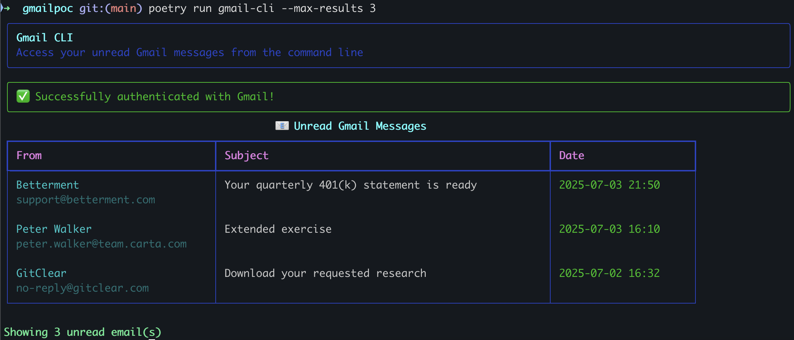

# Gmail CLI

A command-line interface tool to access Gmail and list unread emails in a formatted table.

## Features

- 🔐 Secure Gmail API authentication using OAuth 2.0
- 📧 List unread emails with sender, subject, and date
- 🎨 CLI formatting using Rich library
- 🔧 Easy setup with Poetry

## Prerequisites

- Python 3.9 or higher
- Poetry (for dependency management)
- Gmail account with API access (with OAuth) enabled

## Installation

1. Clone this repository

2. Install dependencies using Poetry:
```bash
poetry install
```

3. Check setup
```bash
poetry run python setup_check.py
```

## Gmail API Setup

Before using this tool, you need to set up Gmail API access:

### 1. Create a Google Cloud Project

1. Go to [Google Cloud Console](https://console.cloud.google.com/)
2. Create a new project or select an existing one
3. Enable the Gmail API for your project

### 2. Create OAuth 2.0 Credentials

1. In the Google Cloud Console, go to "APIs & Services" > "Credentials"
2. Click "Create Credentials" > "OAuth 2.0 Client IDs"
3. Choose "Desktop application" as the application type
4. Download the JSON credentials file
5. Rename it to `credentials.json` and place it in the project root

### 3. Configure Scopes

The application requires the following Gmail API scopes:
- `https://www.googleapis.com/auth/gmail.readonly` - Read access to emails

## Usage

### First Run (Authentication)

On first run, the application will open a browser window for OAuth authentication:

```bash
poetry run gmail-cli
```

Follow the authentication flow in your browser. The application will save the token for future use.

### List Unread Emails

```bash
poetry run gmail-cli
```

It will display a formatted table, example:



### Command Line Options

```bash
poetry run gmail-cli --help
```

## Project Structure

```
gmailpoc/
├── pyproject.toml                # Poetry configuration
├── README.md                     # This file
├── .gitignore                    # Git ignore rules
├── credentials.json              # Gmail API credentials (not versioned)
├── token.json                    # OAuth token (not versioned)
└── gmail_cli/
    ├── __init__.py
    ├── main.py                   # CLI entry point
    ├── gmail_client.py           # Gmail API client
    ├── message_utils.py          # Display formatted messages in CLI
    └── email_table_formatter.py  # CLI table formatting
```

## Dependencies

- **google-api-python-client**: Gmail API client
- **google-auth**: Google authentication
- **rich**: CLI formatting
- **click**: CLI framework

## Development

### Install Development Dependencies

```bash
poetry install --with dev
```

### Run Tests

```bash
poetry run pytest -v
```

Run coverage reporting:
```bash
poetry run pytest --cov=gmail_cli
```

### Code Formatting

```bash
poetry run black .
poetry run pylint .
poetry run flake8 .
```

Or all at once:
```bash
poetry run black . ; poetry run pylint . ; poetry run flake8
```

## Security Notes

- Never commit `credentials.json` or `token.json` to version control
- The `.gitignore` file is configured to exclude these sensitive files
- OAuth tokens are stored locally and should be kept secure

## Troubleshooting

### Authentication Issues

If you encounter authentication problems:

1. Delete the `token.json` file
2. Ensure `credentials.json` is in the project root
3. Run the application again to re-authenticate

### API Quotas

Gmail API has daily quotas. If you hit limits:
- Check your Google Cloud Console for quota usage
- Consider implementing rate limiting for large email volumes
